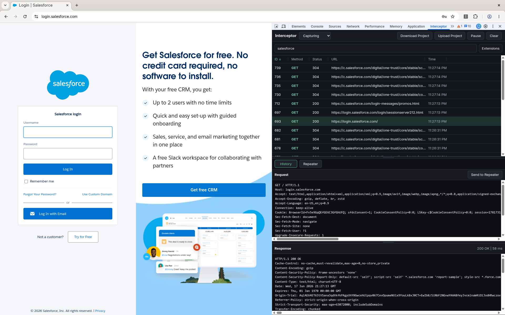
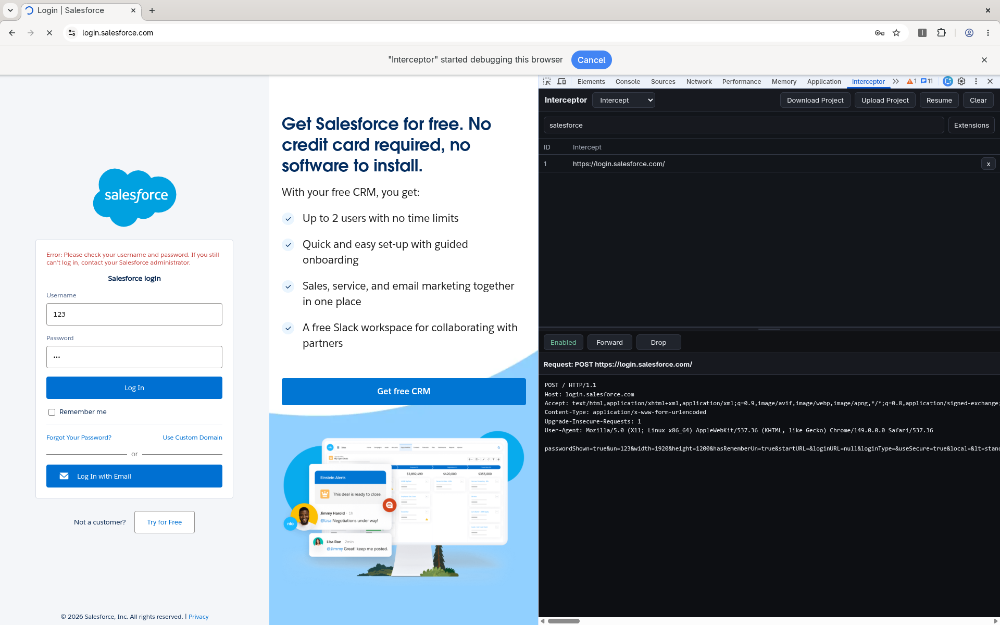
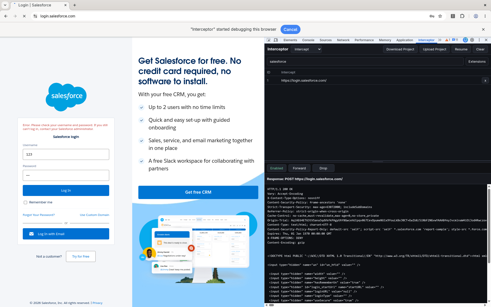

# Interceptor

Interceptor is a Chrome/Chromium DevTools extension for authorized web application testing. It captures request/response history while you browse, lets you send requests to editable repeater tabs, and provides a Burp-style intercept workflow for pausing, editing, forwarding, or dropping traffic.

> Use Interceptor only on systems you own or have explicit permission to test.

## Features

- DevTools panel for Chrome and Chromium.
- Request history with method, status, URL, timestamp, filtering, sorting, highlighting, and URL actions.
- Raw request and response viewers.
- Multi-tab repeater with editable raw requests and saved responses.
- Request and response interception with editable raw messages.
- URL allow-list for Intercept mode.
- Exact URL blocking from the history context menu.
- Project export/import for history and repeater work.

## Screenshots

### Main History

### Repeater

### Intercept Request

### Intercept Response

## Installation

1. Open `chrome://extensions`.
2. Enable **Developer mode**.
3. Click **Load unpacked**.
4. Select this repository folder.
5. Open DevTools on the target tab.
6. Select the **Interceptor** DevTools panel.

After updates, click **Reload** on the extension card in `chrome://extensions`, then close and reopen DevTools.

## Capture Mode

Keep the Interceptor DevTools panel open while browsing the authorized target. Captured traffic appears in the left-side History table.

The top-left mode selector has:

- **Capturing**: records requests and responses into History.
- **Intercept**: opens the intercept workflow and pauses matching traffic.

The toolbar **Pause/Resume** button pauses or resumes passive history capture while you are in Capturing mode.

## History

History shows:

- `ID`: sequential captured request number.
- `Method`: HTTP method.
- `Status`: response status code.
- `URL`: request URL.
- `Time`: capture time.

You can:

- Click column headers to sort ascending/descending.
- Drag the `|` separators in the header to resize columns.
- Use the **Extensions** menu to hide or show common static file types.
- Resize the History pane using the splitter between History and details.
- Resize the Request/Response detail panes with the horizontal splitter.
- Scroll horizontally when content is wider than the panel.

Right-click a non-URL part of a row to highlight the item:

- Red
- Yellow
- Blue
- Green
- Purple
- None

Right-click the URL itself for URL actions:

- **Copy**: copies the full URL to the clipboard.
- **Delete**: removes the item from History.
- **Intercept**: adds/removes the exact URL from the Intercept URL list. Intercepted URLs are shown in green.
- **Block/Unblock**: blocks or unblocks the exact URL using Chrome dynamic blocking rules. Blocked URLs are shown in red.

## Request And Response Details

Selecting a history item displays:

- Raw request text.
- Raw response text.

HTTP/2 pseudo-headers such as `:authority`, `:method`, `:path`, and `:scheme` are filtered from raw request text because they are browser-managed pseudo-headers, not editable raw HTTP headers.

## Repeater

Click **Send to Repeater** from a selected history item to create a new repeater tab.

In Repeater:

- Each sent request gets its own tab.
- Double-click a repeater tab name to rename it.
- Edit the raw request text.
- Click **Send** to replay the request.
- The latest response is shown in the response pane.
- Drag the horizontal splitter to resize the request/response panes.

Some browser-controlled headers cannot be set by extension `fetch`, including `Cookie`, `Host`, `Content-Length`, `Origin`, `Referer`, and `sec-*`. If such headers are skipped, Interceptor shows them in the response metadata.

## Intercept Mode

Select **Intercept** from the top-left mode selector.

In Intercept mode:

- The left pane changes from History to the **Intercept** URL list.
- The top action buttons become **Enabled/Disabled**, **Forward**, and **Drop**.
- If the Intercept URL list is empty, all requests/responses are intercepted.
- If the Intercept URL list contains one or more URLs, only exact matching URLs are intercepted.

Use **Enabled/Disabled** to toggle active interception:

- **Enabled**: interception is active.
- **Disabled**: interception is off and traffic passes through.

When traffic is paused:

- A request is shown as editable raw request text.
- A response is shown as editable raw response text.
- **Forward** forwards the edited request or response.
- **Drop** drops the paused request or response.

In the Intercept URL list:

- Each URL has an `ID` sequence number.
- Double-click a URL to edit it.
- Press `Enter` or click away to save.
- Press `Esc` to cancel.
- Right-click a URL and choose **Remove** to remove it from the list.

## Projects

Use **Download Project** to save your current work as JSON.

The project file includes:

- History.
- Selected history item and sequence counter.
- Repeater tabs, including tab names, editable requests, latest responses, and repeater layout state.

The project file does **not** save Intercept mode state or Intercept URL lists.

Use **Upload Project** to restore a saved project JSON file.

## Browser Notes And Limitations

- Response body capture uses the Chrome DevTools Network API, so the DevTools panel must stay open.
- Interception uses Chrome’s `debugger` API and requires accepting the debugger permission.
- Blocking uses Chrome dynamic declarative network request rules.
- Repeater requests are sent by the extension background worker, so browser security rules still apply.
- Some compressed/binary response bodies may not be convenient to edit as text.

## Troubleshooting

If the **Interceptor** tab does not appear:

1. Open `chrome://extensions`.
2. Find **Interceptor**.
3. Make sure it is enabled.
4. Click **Reload**.
5. Accept any permission prompts.
6. Close and reopen DevTools.

If Intercept mode does not pause requests:

- Make sure the top-left mode selector is set to **Intercept**.
- Make sure the Intercept toggle says **Enabled**.
- If your Intercept URL list is not empty, verify the URL exactly matches the request URL.
- Reload the extension after code changes.

If response forwarding fails:

- Check that the raw response status line looks like `HTTP/1.1 200 OK`.
- Avoid manually setting `Content-Length`, `Transfer-Encoding`, or `Content-Encoding`; Interceptor filters these when forwarding edited responses.
